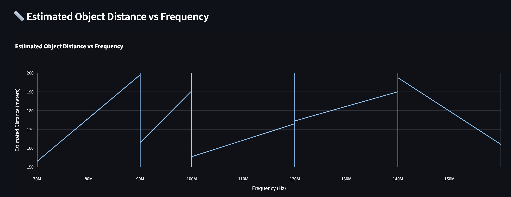

#  AirScanAI: Aerial Threat Detection Dashboard

**AirScanAI** is a real-time simulation tool that combines radar data and computer vision to detect and track aerial objects such as drones and UAVs. It mimics the type of multi-sensor threat detection used in defense systems like those built by DRDO labs (ADE, ADRDE, CABS, etc.).

---

##  Features

-  Simulated radar signal tracking using a CSV dataset  
-  Live object detection using webcam (OpenCV)  
-  Sensor fusion with Kalman Filter for accurate tracking  
-  Interactive dashboard built with Streamlit

---

##  Project Structure

```

AirScanAI/
├── data/
│   └── radar\_mock.csv           # Sample radar signals
├── sensors/
│   ├── radar\_processor.py       # Radar data processing
│   ├── vision\_processor.py      # Camera-based detection
│   └── fusion\_engine.py         # Combines radar and vision
├── utils/
│   └── kalman\_filter.py         # Kalman filter logic
├── dashboard/
│   └── streamlit\_app.py         # Dashboard interface
├── main.py                      # Main simulation script
├── requirements.txt
└── README.md

````

---

##  Getting Started

### Step 1: Install dependencies
```bash
pip install -r requirements.txt
````

### Step 2: Run the main simulation

```bash
python main.py
```

### Step 3: Launch the Streamlit dashboard

```bash
streamlit run dashboard/streamlit_app.py
```

> Ensure `radar_mock.csv` is present in the `data/` folder before starting.

---

##  Sample Radar Data Format

```csv
timestamp,signal_strength,object_distance,latitude,longitude
2024-06-25 10:00:00,78,125,12.9716,77.5946
2024-06-25 10:00:05,82,121,12.9717,77.5948
...
```

---

##  Built With

* Python
* OpenCV
* Pandas & NumPy
* Streamlit
* Custom Kalman Filter

##  Author

**Shruti Raj**
## 📸 Demo Screenshots


### 📏 Estimated Object Distance vs Frequency


### 📶 Signal Strength vs Frequency


### Radar & Camera Tracking in Sync


### Real-time Dashboard View


